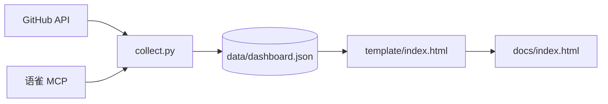

# data-dashboard — 数据聚合看板

一屏总览个人数据。采集多源 → 统一 JSON → 单页 HTML。

## 数据流



## 数据源

| 源 | 方式 | 采集内容 |
|---|---|---|
| GitHub | REST API（urllib，token） | 仓库数、commit 趋势（1/7/30/365天）、open PR/Issue、Star 榜、最近活跃 |
| 语雀 | mcporter → `yuque_get_editor_center` | 知识库/文档/小记数、字数、编辑次数/天数、获赞 |

## 用法

```bash
cd code/data-dashboard
python3 collect.py                 # 采集 + 渲染
python3 collect.py --collect-only  # 只采集
python3 collect.py --render-only   # 只渲染
```

产物：
- `data/dashboard.json` — 中间数据
- `docs/index.html` — 单页看板（GitHub Pages 源）

## 依赖

- Python 3.10+（只用标准库）
- 环境变量（见 `~/.openclaw/secrets/credentials.env`）：
  - `GITHUB_PAT_CLASSIC` 或 `GITHUB_PAT_FINEGRAINED`
- `mcporter` CLI（语雀源走 `yuque-mcp`，需本地 MCP server 在线）

## 扩展新源

1. 在 `sources/` 加模块，实现 `collect() -> dict`
2. 在 `collect.py` 的 `SOURCES` 元组注册
3. 模板里按 `DATA.sources.<name>` 渲染

单源失败不影响整体（写入 `{"error": "..."}`）。